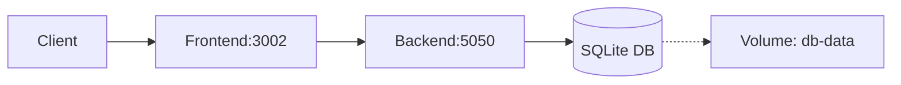

# 🐳 Docker Documentation - OrganizedLife

Complete guide for running OrganizedLife with Docker and Docker Compose.

## 📑 Table of Contents

- [Introduction](#introduction)
- [Prerequisites](#prerequisites)
- [Quick Start](#quick-start)
- [Architecture](#architecture)
- [Docker Images](#docker-images)
- [Docker Compose](#docker-compose)
- [Environment Variables](#environment-variables)
- [Useful Commands](#useful-commands)
- [Development](#development)
- [Production](#production)
- [Troubleshooting](#troubleshooting)
- [Best Practices](#best-practices)

---

## Introduction

OrganizedLife is fully containerized using Docker, providing:

- ✅ **Portability**: Run anywhere Docker is available
- ✅ **Consistency**: Same environment in development and production
- ✅ **Isolation**: Each service in its own container
- ✅ **Scalability**: Easy to add services and scale horizontally
- ✅ **Easy maintenance**: Simplified dependency management

## Prerequisites

Before starting, make sure you have installed:

- **Docker** >= 20.10 ([Install Docker](https://docs.docker.com/get-docker/))
- **Docker Compose** >= 2.0 (included with Docker Desktop)
- **Make** (optional, but recommended for simplified commands)

### Verifying installation

```bash
docker --version
docker compose version
make --version  # optional
```

## Quick Start

### 1. Clone and configure

```bash
# Clone the repository
git clone https://github.com/CristianRicardoLeite/organizedLife.git
cd organizedLife

# Copy and configure environment variables
cp .env.example .env
# Edit .env and set JWT_SECRET at minimum
```

### 2. Run in development mode

```bash
# Using Make (recommended)
make dev

# OR using docker compose directly
docker compose -f docker-compose.yml -f docker-compose.dev.yml up
```

### 3. Access the application

- **Frontend**: http://localhost:3002
- **Backend API**: http://localhost:5050
- **Swagger**: http://localhost:5050/swagger
- **Backend Health**: http://localhost:5050/api/health
- **Frontend Health**: http://localhost:3002/health

### 4. Stop the application

```bash
make dev-down
# OR
docker compose -f docker-compose.yml -f docker-compose.dev.yml down
```

## Architecture

### Services

1. **backend** (OrganizedLife API)
   - .NET 10 Web API
   - Exposed ports: 5050 (HTTP), 5051 (HTTPS)
   - SQLite database in persistent volume
   - Health check at `/api/health`

2. **frontend** (React SPA)
   - React 18 with Vite
   - Nginx server in production
   - Exposed port: 3002
   - Health check at `/health`

### Network

- **Network**: `organized-life-network`
- Services communicate internally using service names
- Only necessary ports are exposed to the host

### Volumes

- **db-data**: SQLite database persistence
- **db-data-dev**: Development database
- **db-data-prod**: Production database



## Docker Images

### Backend Image

**File**: `backend/OrganizedLife.API/Dockerfile`

**Multi-stage build**:
1. **build**: Compiles the .NET application
   - Base: `mcr.microsoft.com/dotnet/sdk:10.0`
   - Restores dependencies
   - Compiles in Release mode
   - Publishes to `/app/publish`

2. **runtime**: Runs the application
   - Base: `mcr.microsoft.com/dotnet/aspnet:10.0`
   - Copies only binaries from build stage
   - Installs curl for health checks
   - Final size: ~441MB

### Frontend Image

**File**: `frontend/Dockerfile`

**Multi-stage build**:
1. **build**: Compiles the React application
   - Base: `node:20-alpine`
   - Installs dependencies with `npm ci`
   - Builds static files with `npm run build`

2. **production**: Serves with Nginx
   - Base: `nginx:1.25-alpine`
   - Copies build from build stage
   - Configures SPA routing with nginx.conf
   - Final size: ~75.6MB

## Docker Compose

### docker-compose.yml (Base)

Main configuration with:
- Service definitions
- Port mappings
- Networks
- Volumes
- Health checks
- Restart policies

### docker-compose.dev.yml (Development)

Development additions:
- **Hot reload** for backend and frontend
- Volume mounts for source code
- Development environment variables
- `DOTNET_USE_POLLING_FILE_WATCHER=true`

### docker-compose.prod.yml (Production)

Production optimizations:
- Optimized builds (runtime target)
- No source code volumes
- Stricter health checks
- Restart policies: `unless-stopped`
- Resource limits (CPU, memory)

## Environment Variables

### Backend Variables

```bash
# Environment
ASPNETCORE_ENVIRONMENT=Development|Production

# Database
DATABASE_PATH=/app/data/organizedlife.db
ConnectionStrings__DefaultConnection=Data Source=/app/data/organizedlife.db

# JWT
JWT_SECRET=your-super-secret-key-min-32-chars  # REQUIRED!
JWT_ISSUER=OrganizedLife
JWT_AUDIENCE=OrganizedLifeUsers
JWT_EXPIRATION_HOURS=24

# CORS
CORS_ORIGINS=http://localhost:5173,http://localhost:3002,http://frontend:80

# Ports
BACKEND_PORT=5050
BACKEND_HTTPS_PORT=5051
```

### Frontend Variables

```bash
# API URL
VITE_API_BASE_URL=http://localhost:5050/api

# Port
FRONTEND_PORT=3002
```

### Docker Compose Variables

```bash
# Build mode
DEV_MODE=true
```

## Useful Commands

### Using Makefile (Recommended)

```bash
# General
make help              # Show all available commands

# Development
make dev               # Start development environment
make dev-build         # Build and start dev
make dev-down          # Stop dev environment
make dev-logs          # View dev logs

# Production
make prod              # Start production environment
make prod-build        # Build and start prod
make prod-down         # Stop prod environment
make prod-logs         # View prod logs

# Build
make build             # Build all images
make build-backend     # Build only backend
make build-frontend    # Build only frontend

# Logs
make logs              # View logs from all containers
make logs-backend      # View backend logs
make logs-frontend     # View frontend logs
make logs-follow       # Follow logs in real-time

# Access containers
make shell-backend     # Access backend shell
make shell-frontend    # Access frontend shell
make db-shell          # Access database (SQLite)

# Cleanup
make clean             # Remove containers and volumes
make clean-images      # Remove images
make clean-all         # Remove everything
make prune             # Docker system prune

# Health checks
make health            # Check health of all services
make health-backend    # Check backend health
make health-frontend   # Check frontend health

# Utilities
make ps                # List running containers
make restart           # Restart all containers
make stop              # Stop all containers
make start             # Start stopped containers
```

### Using Docker Compose directly

```bash
# Development
docker compose -f docker-compose.yml -f docker-compose.dev.yml up
docker compose -f docker-compose.yml -f docker-compose.dev.yml up -d  # detached
docker compose -f docker-compose.yml -f docker-compose.dev.yml down

# Production
docker compose -f docker-compose.yml -f docker-compose.prod.yml up -d
docker compose -f docker-compose.yml -f docker-compose.prod.yml down

# Logs
docker compose logs -f                    # all services
docker compose logs -f backend            # only backend
docker compose logs -f frontend           # only frontend
docker compose logs --tail=100 backend    # last 100 lines

# Build
docker compose build                      # all
docker compose build backend              # only backend
docker compose build --no-cache           # without cache

# Access containers
docker compose exec backend bash
docker compose exec frontend sh

# Restart
docker compose restart
docker compose restart backend

# Remove
docker compose down                       # stop and remove
docker compose down -v                    # also remove volumes
docker compose down --rmi all             # also remove images
```

## Development

### Hot Reload

In development mode, changes to source code are automatically reflected:

**Backend (.NET)**:
- Uses `dotnet watch run`
- Watches `.cs`, `.csproj`, `.json` files
- Automatic restart on changes
- Takes ~3-5 seconds to reload

**Frontend (React)**:
- Uses Vite in dev mode
- Hot Module Replacement (HMR)
- Instant updates in browser
- Preserves component state

### Debug

**Backend:**
```bash
# Access backend logs
make logs-backend

# Access backend container
make shell-backend

# Check health endpoint
curl http://localhost:5050/api/health
```

**Frontend:**
```bash
# Access frontend logs
make logs-frontend

# Access frontend container
make shell-frontend

# Check health endpoint
curl http://localhost:3002/health
```

### Database

**Access SQLite database:**
```bash
# Enter backend container
make shell-backend

# Access database
cd /app/data
sqlite3 organizedlife.db

# SQLite commands
.tables              # list tables
.schema users        # show schema
SELECT * FROM users; # query
.quit               # exit
```

**Migrations:**
```bash
# Inside backend container
dotnet ef migrations add MigrationName
dotnet ef database update
```

## Production

### Build for production

```bash
# Build production images
make prod-build

# Or with docker compose
docker compose -f docker-compose.yml -f docker-compose.prod.yml build
```

### Run in production

```bash
# Start in background (detached)
make prod

# Check if services are healthy
make health

# View logs
make prod-logs
```

### Monitoring

**Health checks:**
```bash
# Check all services
docker compose ps

# Health endpoints
curl http://localhost:5050/api/health  # backend
curl http://localhost:3002/health      # frontend
```

**Resource usage:**
```bash
# CPU and memory usage
docker stats

# Only OrganizedLife containers
docker stats $(docker ps --filter name=organized-life --format "{{.Names}}")
```

### Backup

**Database backup:**
```bash
# Copy database from container
docker cp organized-life-backend:/app/data/organizedlife.db ./backup-$(date +%Y%m%d).db

# Or using volume
docker run --rm -v organized-life-db-data:/data -v $(pwd):/backup alpine \
  tar czf /backup/db-backup-$(date +%Y%m%d).tar.gz /data
```

**Restore backup:**
```bash
# Stop containers
make prod-down

# Replace database
docker run --rm -v organized-life-db-data:/data -v $(pwd):/backup alpine \
  tar xzf /backup/db-backup-YYYYMMDD.tar.gz -C /

# Start containers
make prod
```

## Troubleshooting

### Common Issues

#### Port already in use

**Error**: `Bind for 0.0.0.0:5050 failed: port is already allocated`

**Solution**:
```bash
# Check what's using the port
lsof -i :5050  # macOS/Linux
netstat -ano | findstr :5050  # Windows

# Change port in .env
BACKEND_PORT=5051

# Or stop the conflicting process
```

#### Container fails to start

**Check logs**:
```bash
docker compose logs backend
docker compose logs frontend
```

**Common causes**:
- Missing or invalid environment variables
- Database migration errors
- Port conflicts
- Insufficient disk space

#### Database locked

**Error**: `database is locked`

**Solution**:
```bash
# Stop all containers
make prod-down

# Remove lock file
docker volume rm organized-life-db-data

# Start again
make prod-build
```

#### Out of disk space

**Check space**:
```bash
docker system df
```

**Clean up**:
```bash
# Remove unused data
make prune

# Or more aggressive cleanup
docker system prune -a --volumes
```

### Reset everything

```bash
# Stop and remove everything
make clean-all

# Remove .env
rm .env

# Start fresh
cp .env.example .env
# Edit .env
make dev-build
```

## Best Practices

### Security

1. **Never commit .env with sensitive data**
   - Use `.env.example` as template
   - Change `JWT_SECRET` in production
   - Use strong, random secrets (min 32 characters)

2. **Use secrets management in production**
   - Docker Secrets
   - Azure Key Vault
   - AWS Secrets Manager
   - HashiCorp Vault

3. **Keep images updated**
   ```bash
   docker compose pull
   docker compose up -d
   ```

### Performance

1. **Use multi-stage builds**
   - ✅ Already implemented
   - Reduces final image size
   - Only runtime dependencies

2. **Optimize layer caching**
   - Copy package files first
   - Install dependencies
   - Copy source code last

3. **Limit resources in production**
   ```yaml
   deploy:
     resources:
       limits:
         cpus: '1'
         memory: 512M
   ```

### Maintenance

1. **Regular backups**
   - Automate database backups
   - Test restore process
   - Store backups securely

2. **Monitor logs**
   ```bash
   # Rotate logs
   docker compose logs --tail=1000 > logs/$(date +%Y%m%d).log
   ```

3. **Update dependencies**
   ```bash
   # Backend
   dotnet outdated
   dotnet add package PackageName

   # Frontend
   npm outdated
   npm update
   ```

### CI/CD

Example GitHub Actions workflow:

```yaml
name: Docker Build and Deploy

on:
  push:
    branches: [ main ]

jobs:
  build:
    runs-on: ubuntu-latest
    steps:
      - uses: actions/checkout@v2
      
      - name: Build images
        run: docker compose -f docker-compose.yml -f docker-compose.prod.yml build
      
      - name: Run tests
        run: docker compose run backend dotnet test
      
      - name: Push to registry
        run: |
          docker tag organizedlife-backend:latest $REGISTRY/backend:latest
          docker push $REGISTRY/backend:latest
```

---

## Additional Resources

- **Docker Documentation**: https://docs.docker.com/
- **Docker Compose Documentation**: https://docs.docker.com/compose/
- **.NET Docker Guide**: https://docs.microsoft.com/en-us/dotnet/core/docker/introduction
- **React Docker Guide**: https://create-react-app.dev/docs/deployment/#docker

---

## Support

If you encounter issues:

1. Check logs: `make logs`
2. Verify health checks: `make health`
3. Consult this documentation
4. Open an issue on GitHub

---

**Last Updated**: December 30, 2025
**Version**: 1.0.0
